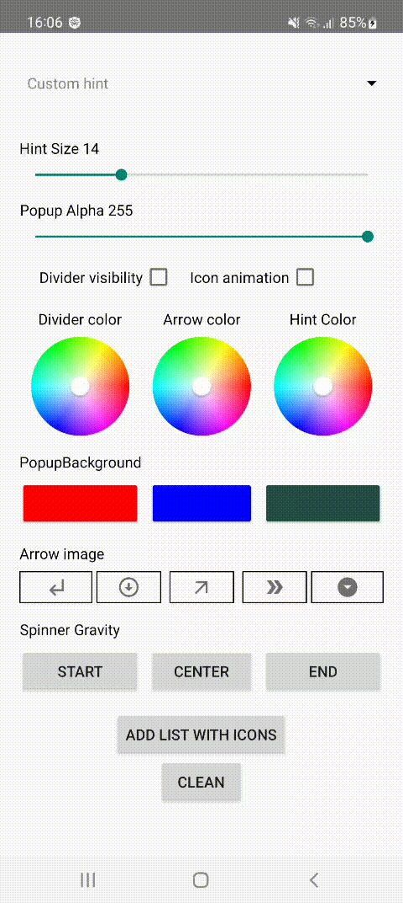

[](https://jitpack.io/#Mobile-Innowise-Group/HintedSpinner)
# HintedSpinner

A library that provides a hint to a spinner. Contains a set of attributes for customising font size, arrows, divider, item layout, item background.


<br/>
<br/>
<br/>

## Download


Add below lines to root's build.gradle
```gradle
allprojects {
	repositories {
		...
		maven { url 'https://jitpack.io' }
	}
}
```    

Grab via Gradle
```gradle
implementation 'com.github.Mobile-Innowise-Group:HintedSpinner:{latest version}'
```
<br/>

## Description

| Method | What it does |
|----------------|---------|
| setItems | set List of String values |
| setSelection | select a specific list item |
| setHint | set your hint |
| setHintTextSize | set size of your hint|
| setHintTextColor | set color of your hint |
| setPopupBackground | set background of the open spinner |
| showDivider | show (or hide) divider |
| setDividerColor | set color of your divider |
| setArrowDrawable | set your custom arrow picture |
| setArrowTint | set tint for your arrow |
| setOnSelectItemAction | make something when item selected |
| setItemsWithIcons | make List of String values with icons |

<br/>

## Usage

At start set list of items:
```xml
<resources>
    <string-array name="text">
        <item>Standard Text</item>
        <item>Meeeeeeeeeeeeeeedium Text</item>
        <item>Very looooooooooooooooooooooooooooooooooooooooooong</item>
    </string-array>
</resources>
```

After you get simple spinner:

#### **activity_main.xml：**
```xml
<com.innowisegroup.hintedspinner.HintedSpinner
    android:id="@+id/hintedSpinner"
    android:layout_width="match_parent"
    android:layout_height="wrap_content"
    app:hint="Custom hint"
    app:items="@array/text" />
```
<br/>

__Collapsed spinner:__


__Expanded spinner:__


<br/>

If you want, you can customize the attributes

### **activity_main.xml**
```xml
<com.innowisegroup.hintedspinner.HintedSpinner
    android:id="@+id/hintedSpinner"
    android:layout_width="match_parent"
    android:layout_height="wrap_content"
    android:layout_marginHorizontal="20dp"
    app:hintTextSize="24sp"
    app:hintTextColor="@color/red"
    app:hint="Custom hint"
    app:withDivider="true"
    app:dividerColor="@color/dark_green"
    app:arrowDrawable="@drawable/example_arrow_4"
    app:arrowTint="@color/colorAccent"
    app:popupBackground="@color/light_blue"
    app:items="@array/text" />

```

<br/>

__Collapsed spinner:__


__Expanded spinner:__


<br/>
<br/>

# Sample

[Sample (MainActivity.kt)](https://github.com/Mobile-Innowise-Group/HintedSpinner/blob/refactor/readme/app/src/main/java/com/innowisegroup/hintedspinner/sample/MainActivity.kt)

[Sample (activity_main.xml)](https://github.com/Mobile-Innowise-Group/HintedSpinner/blob/refactor/readme/app/src/main/res/layout/activity_main.xml)

<br/>

# License

MIT License


Copyright (c) 2019 Innowise Group


Permission is hereby granted, free of charge, to any person obtaining a copy of this software and associated documentation files (the "Software"), to deal in the Software without restriction, including without limitation the rights to use, copy, modify, merge, publish, distribute, sublicense, and/or sell copies of the Software, and to permit persons to whom the Software is furnished to do so, subject to the following conditions:


The above copyright notice and this permission notice shall be included in all copies or substantial portions of the Software.


THE SOFTWARE IS PROVIDED "AS IS", WITHOUT WARRANTY OF ANY KIND, EXPRESS OR IMPLIED, INCLUDING BUT NOT LIMITED TO THE WARRANTIES OF MERCHANTABILITY, FITNESS FOR A PARTICULAR PURPOSE AND NONINFRINGEMENT. IN NO EVENT SHALL THE AUTHORS OR COPYRIGHT HOLDERS BE LIABLE FOR ANY CLAIM, DAMAGES OR OTHER LIABILITY, WHETHER IN AN ACTION OF CONTRACT, TORT OR OTHERWISE, ARISING FROM, OUT OF OR IN CONNECTION WITH THE SOFTWARE OR THE USE OR OTHER DEALINGS IN THE SOFTWARE.
