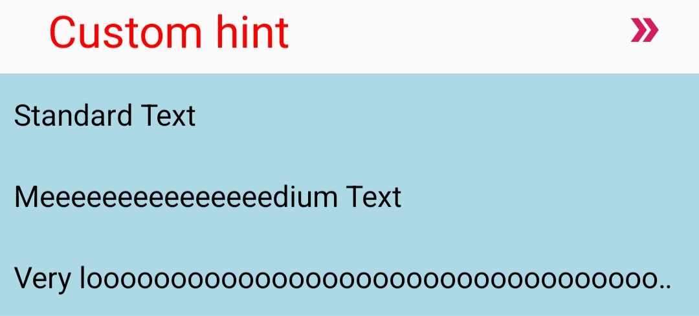

# HintedSpinner

This is a library where you can set a hint in spinner without setting an item in the list as a hint. And also this library helps to customize your spinner’s view, e.g. show divider and replace the arrow with your own.

## Table of Contents

[Demo](https://github.com/Mobile-Innowise-Group/HintedSpinner/blob/refactor/readme/README.md#SampleDemo)

[Installation](https://github.com/Mobile-Innowise-Group/HintedSpinner/blob/refactor/readme/README.md#Installation)

[Methods](https://github.com/Mobile-Innowise-Group/HintedSpinner/blob/refactor/readme/README.md#Methods)

[How it can be used](https://github.com/Mobile-Innowise-Group/HintedSpinner/blob/refactor/readme/README.md#Howitcanbeused)

[Sample code](https://github.com/Mobile-Innowise-Group/HintedSpinner/blob/refactor/readme/README.md#Samplecode)

[Authors](https://github.com/Mobile-Innowise-Group/HintedSpinner/blob/refactor/readme/README.md#Authors)

[License](https://github.com/Mobile-Innowise-Group/HintedSpinner/blob/refactor/readme/README.md#License)

## OVERVIEW

## Sample Demo


## Installation

Grab via Gradle
```gradle
implementation 'com.innowisegroup.hintedspinner:hintedspinner:1.0.0'
```

## Methods

| Method | What does it do |
|----------------|---------|
| setItems | set List of String values |
| setSelection | select a specific list item |
| setHint | set your hint |
| setHintTextSize | set size of your hint|
| setHintTextColor | set color of your hint |
| setPopupBackground | set background of the open spinner |
| showDivider | show (or hide) divider |
| setDividerColor | set color of your divider |
| setArrowDrawable | set your custom arrow picture |
| setArrowTint | set tint for your arrow |
| setOnSelectItemAction | make something when item selected |

## How it can be used?

At start set list of items:
```xml
<resources>
    <string-array name="text">
        <item>Standard Text</item>
        <item>Meeeeeeeeeeeeeeedium Text</item>
        <item>Very looooooooooooooooooooooooooooooooooooooooooong</item>
    </string-array>
</resources>
```

After you get simple spinner:

#### **activity_main.xml：**
```xml
<com.innowisegroup.hintedspinner.HintedSpinner
        android:id="@+id/hintedSpinner"
        android:layout_width="match_parent"
        android:layout_height="wrap_content"
        app:hint="Custom hint"
        app:items="@array/text" />
```
Closed spinner:


Open spinner:


If you want, you can customize the attributes

### **activity_main.xml**
```xml
<com.innowisegroup.hintedspinner.HintedSpinner
android:id="@+id/hintedSpinner"
android:layout_width="match_parent"
android:layout_height="wrap_content"
android:layout_marginHorizontal="20dp"
app:hintTextSize="24sp"
app:hintTextColor="@color/red"
app:hint="Custom hint"
app:withDivider="true"
app:dividerColor="@color/dark_green"
app:arrowDrawable="@drawable/example_arrow_4"
app:arrowTint="@color/colorAccent"
app:popupBackground="@color/light_blue"
app:items="@array/text" />

```
Closed spinner:


Open spinner:



# Sample code

[Sample (MainActivity.kt)](https://github.com/Mobile-Innowise-Group/HintedSpinner/tree/refactor/readme/app/src/main/java/com/innowisegroup/hintedspinner/sample)

[Sample (activity_main.xml)](https://github.com/Mobile-Innowise-Group/HintedSpinner/tree/refactor/readme/app/src/main/res/layout)

# Authors

__Eugene Shapovalov, Andrei Kryvashei__

# License

MIT License


Copyright (c) 2019 Eugene Shapovalov


Permission is hereby granted, free of charge, to any person obtaining a copy of this software and associated documentation files (the "Software"), to deal in the Software without restriction, including without limitation the rights to use, copy, modify, merge, publish, distribute, sublicense, and/or sell copies of the Software, and to permit persons to whom the Software is furnished to do so, subject to the following conditions:


The above copyright notice and this permission notice shall be included in all copies or substantial portions of the Software.


THE SOFTWARE IS PROVIDED "AS IS", WITHOUT WARRANTY OF ANY KIND, EXPRESS OR IMPLIED, INCLUDING BUT NOT LIMITED TO THE WARRANTIES OF MERCHANTABILITY, FITNESS FOR A PARTICULAR PURPOSE AND NONINFRINGEMENT. IN NO EVENT SHALL THE AUTHORS OR COPYRIGHT HOLDERS BE LIABLE FOR ANY CLAIM, DAMAGES OR OTHER LIABILITY, WHETHER IN AN ACTION OF CONTRACT, TORT OR OTHERWISE, ARISING FROM, OUT OF OR IN CONNECTION WITH THE SOFTWARE OR THE USE OR OTHER DEALINGS IN THE SOFTWARE.